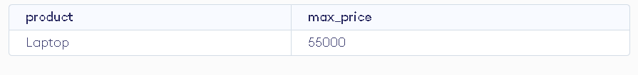

# Sales Analysis Project 📊

## Table of Contents
1. [Overview](#overview)
2. [Table Description](#table-description)
3. [Queries & Results](#queries--results)
4. [Insights](#insights)

## Overview
This project analyzes sales data of a small online shop using SQL. 
The goal: find top customers, revenue trends and product statistics

## Table Description
- Table Name: Sales
- Columns: order_id, customer_name, product, category, quantity, price, order_date
- Sample data: 8 orders

## Queries & Results

### 1️⃣ Total Sales per Order
**Query:** see sales_analysis.sql  
**Result:**  

### 2️⃣ Total Revenue per Customer
**Query:** see sales_analysis.sql  
**Result:**  

### 3️⃣ Number of Products per Category
**Query:** see sales_analysis.sql  
**Result:**  

### 4️⃣ Most Expensive Product Purchased
**Query:** see sales_analysis.sql  
**Result:**  

### 5️⃣ Top Customer by Total Spending
**Query:** see sales_analysis.sql  
**Result:**  

## Insights
- Asha is the top customer
- Electronics category generates the highest revenue
- Most expensive item purchased: Laptop

